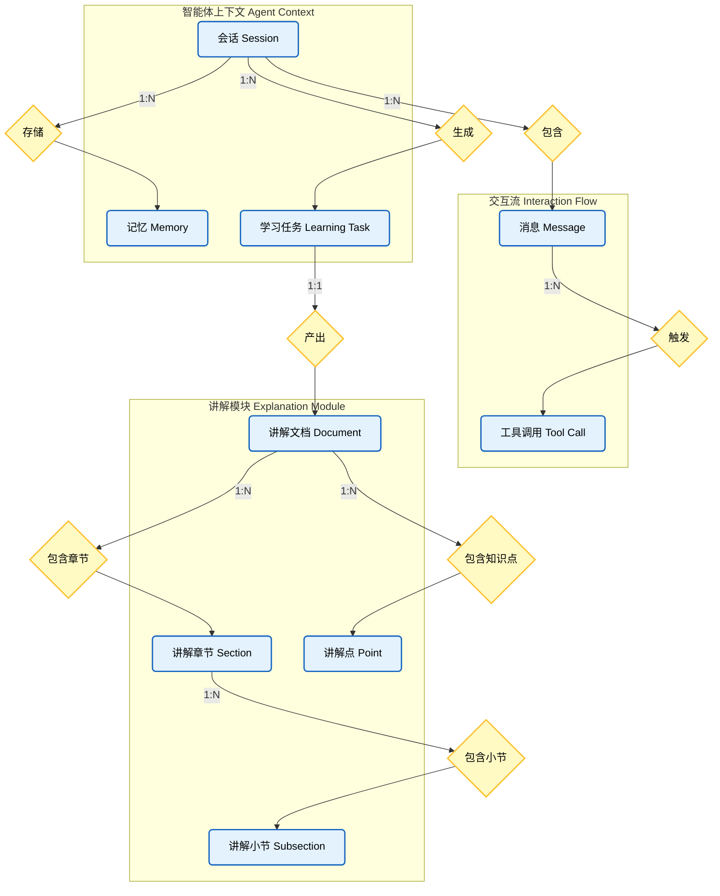

# 智能体与讲解模块数据流转图 (Agent & Explanation Data Flow)

## 实体关系说明

### 1. 智能体上下文 (Agent Context)
*   **会话 (Session)**：核心聚合根，管理对话生命周期。
*   **记忆 (Memory)**：存储长期记忆，支持跨会话的知识保持。
*   **学习任务 (Learning Task)**：智能体的长期规划目标，由会话生成。

### 2. 交互流 (Interaction Flow)
*   **消息 (Message)**：记录对话历史。
*   **工具调用 (Tool Call)**：由消息触发，记录具体的工具执行请求。

### 3. 讲解模块 (Explanation Module)
*   **讲解文档 (Document)**：由学习任务产出的最终成果，是结构化的知识输出。
*   **讲解章节 (Section)**：文档的一级结构。
*   **讲解小节 (Subsection)**：章节的子结构，包含具体内容。
*   **讲解点 (Point)**：文档中提取的核心知识点，直接归属于文档，用于构建知识图谱或重点摘要。
