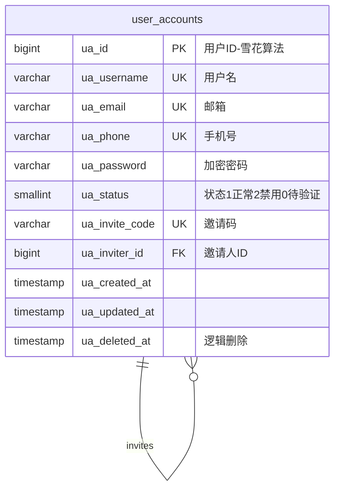
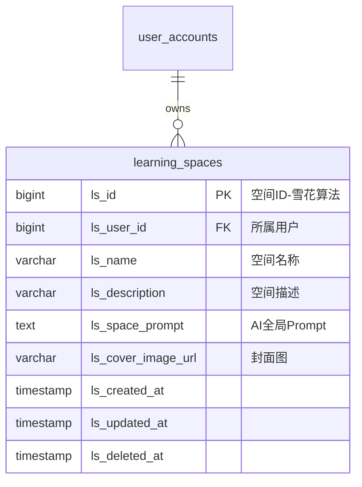
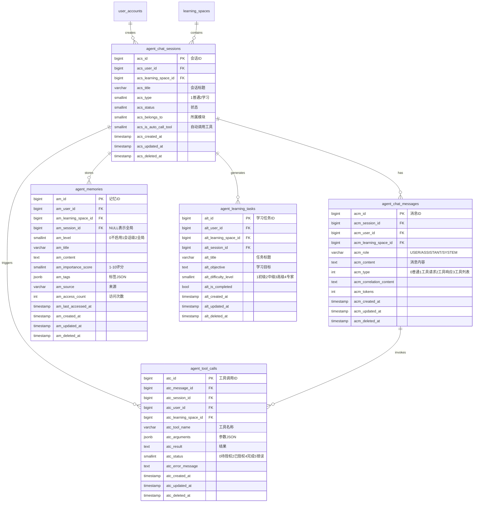
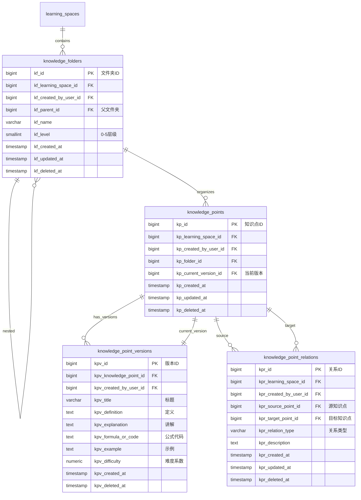
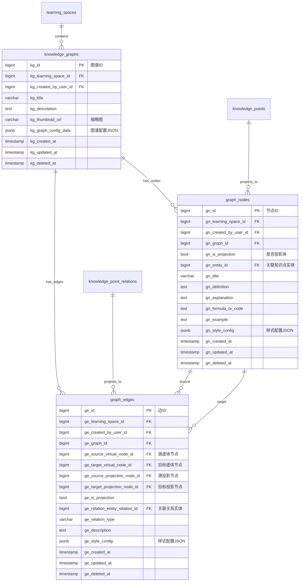
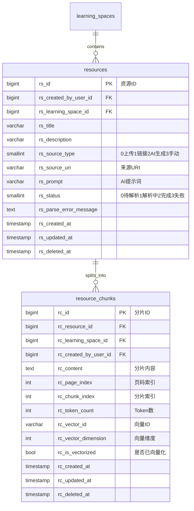
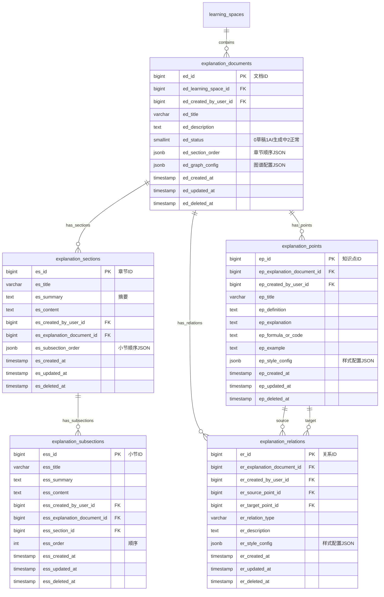
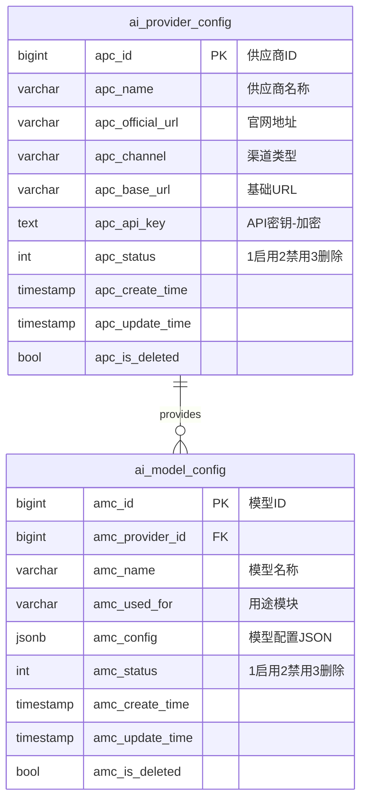
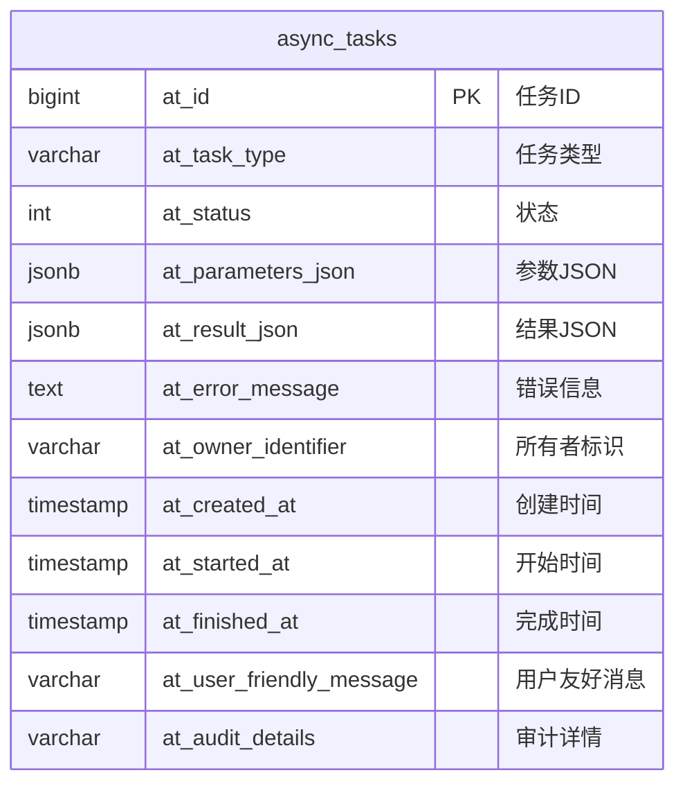
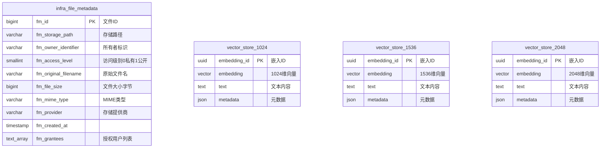

# NEXUS 项目数据库 ER 图设计文档

本文档展示 NEXUS 项目的完整数据库设计，按功能模块分别呈现。

## 📋 目录

1. [用户模块](#1-用户模块)
2. [学习空间模块](#2-学习空间模块)
3. [Agent智能对话模块](#3-agent智能对话模块)
4. [知识点管理模块](#4-知识点管理模块)
5. [知识图谱模块](#5-知识图谱模块)
6. [资源管理模块](#6-资源管理模块)
7. [讲解文档模块](#7-讲解文档模块)
8. [AI配置模块](#8-ai配置模块)
9. [异步任务模块](#9-异步任务模块)
10. [基础设施模块](#10-基础设施模块)

---

## 1. 用户模块

**核心功能**: 用户账户管理、认证授权、邀请机制

---

## 2. 学习空间模块

**核心功能**: 多租户数据隔离核心，每个用户可创建多个独立学习空间

---

## 3. Agent智能对话模块

**核心功能**: 智能对话、工具调用、记忆管理、学习规划

---

## 4. 知识点管理模块

**核心功能**: 知识点组织、版本控制、关系网络

---

## 5. 知识图谱模块

**核心功能**: 可视化知识关系，支持虚体和投影体

---

## 6. 资源管理模块

**核心功能**: 资源上传、解析、分片、向量化

---

## 7. 讲解文档模块

**核心功能**: 结构化文档、知识点关联、图谱集成

---

## 8. AI配置模块

**核心功能**: AI服务商和模型配置管理

---

## 9. 异步任务模块

**核心功能**: 后台任务调度、执行、监控

---

## 10. 基础设施模块

**核心功能**: 文件存储、向量存储

---

## 🔑 关键设计特性

### 1. 数据隔离
- **学习空间**: 核心隔离单元，所有业务数据关联到学习空间
- **多租户**: 同一用户可创建多个独立学习空间

### 2. ID生成策略
- **雪花算法**: 所有业务表主键使用雪花算法生成全局唯一ID
- **自增ID**: 基础设施表（如文件元数据、AI配置）使用自增ID

### 3. 逻辑删除
- **deleted_at**: 所有业务表包含逻辑删除字段
- **数据追溯**: 保留历史数据用于审计和恢复

### 4. 版本控制
- **知识点版本**: 支持知识点内容的演进追踪
- **当前版本指针**: 通过 current_version_id 指向当前使用版本

### 5. 灵活配置
- **JSONB字段**: 大量使用JSONB存储灵活配置（样式、参数、元数据）
- **扩展性**: 便于功能扩展而不修改表结构

### 6. 性能优化
- **索引策略**: 针对高频查询字段创建B-Tree索引
- **GIN索引**: 用于JSONB字段和全文搜索
- **向量索引**: IVFFlat索引优化向量相似度搜索

### 7. 数据完整性
- **外键约束**: 严格的外键约束保证数据一致性
- **级联删除**: 合理的级联策略自动清理关联数据
- **CHECK约束**: 业务规则约束（如邮箱和手机号至少一个）

---

## 📊 统计信息

- **总表数**: 30+
- **核心业务模块**: 7个
- **基础设施模块**: 3个
- **关系数量**: 50+
- **索引数量**: 100+

---

## 🎯 使用建议

1. **开发新功能时**: 先确定数据归属的学习空间
2. **查询优化**: 利用已有索引，避免全表扫描
3. **数据删除**: 使用逻辑删除，保留审计轨迹
4. **扩展字段**: 优先使用JSONB而非频繁修改表结构
5. **向量存储**: 根据嵌入模型维度选择合适的向量表

---

**文档版本**: v1.0  
**最后更新**: 2025-12-20  
**维护者**: NEXUS团队
