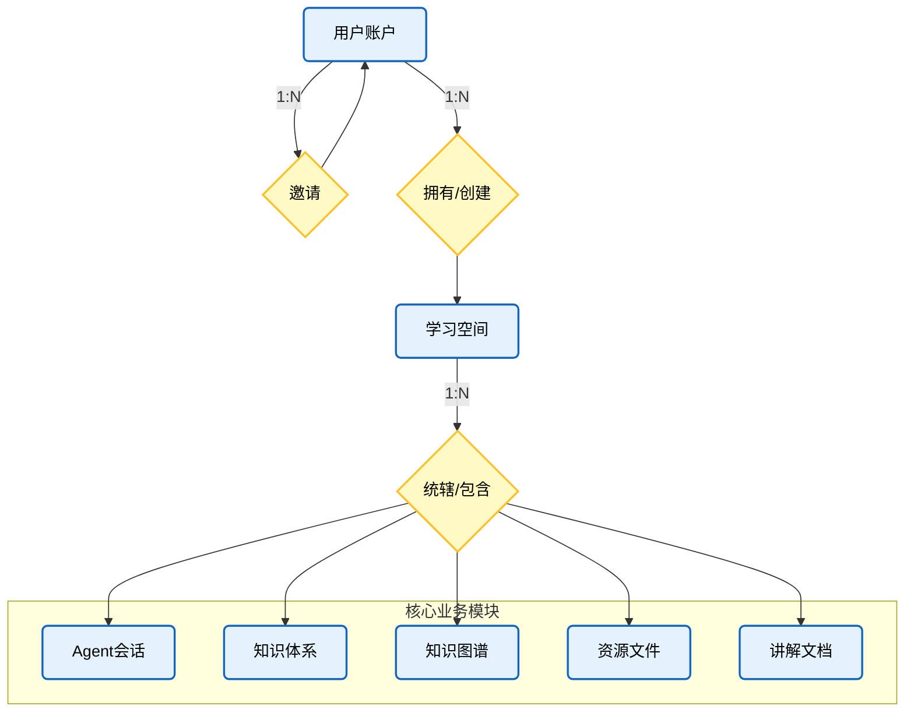
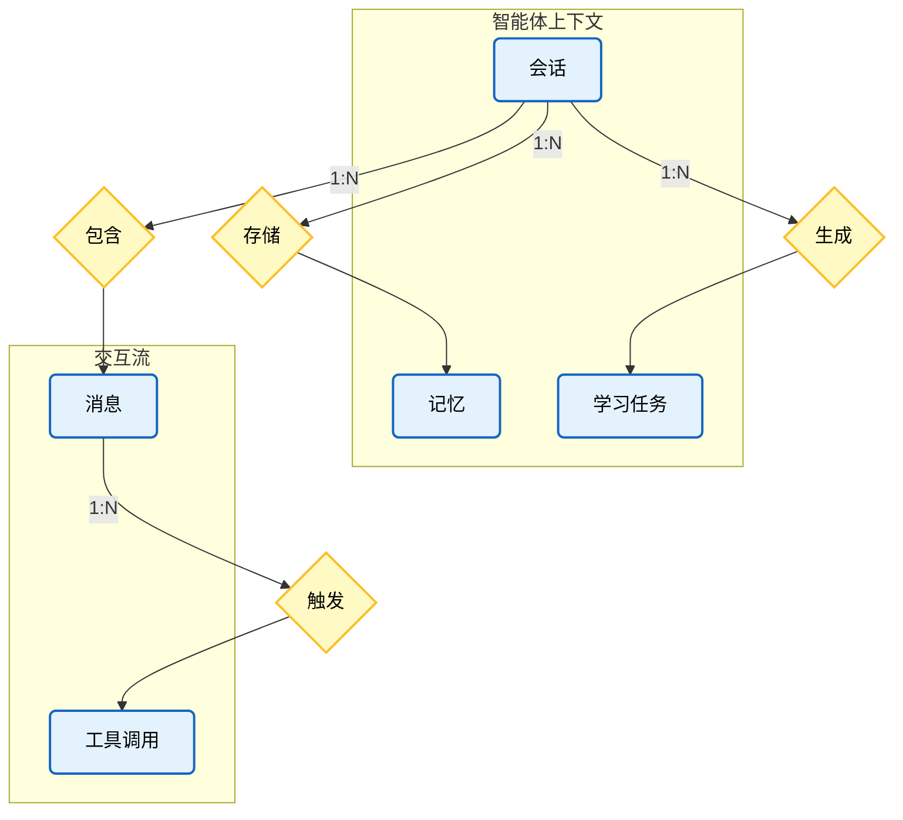
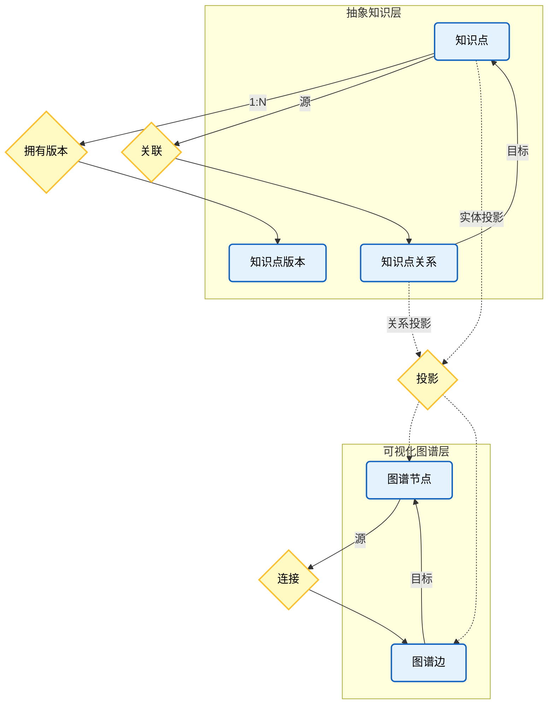

# NEXUS 数据库设计 - 模块化实体关系流程图

本文档采用分模块视图展示数据库实体间的关系，特别强调了 **Agent (智能体)** 在系统中的核心连接作用。

> **图例说明**：
> - 🟦 **蓝色矩形**：实体 (Entity)
> - 🟡 **黄色菱形**：关系 (Relationship)

## 0. 全局统辖与基础架构视图
展示用户账户体系、多租户学习空间以及空间对核心业务模块的统辖关系。



## 1. 智能体核心交互视图 (Agent Core)
展示智能体对话、记忆与工具调用的内部机制。



## 2. 智能体能力与外部关联视图 (核心)
**核心视图**：展示智能体如何通过工具调用连接资源、知识图谱与内容生成模块。

```mermaid
flowchart TD
    %% =================样式定义=================
    classDef entity fill:#e3f2fd,stroke:#1565c0,stroke-width:2px,rx:5,ry:5,color:#000;
    classDef relation fill:#fff9c4,stroke:#fbc02d,stroke-width:2px,shape:rhombus,color:#000;

    subgraph Agent [智能体]
        ChatMessage[消息 / 工具调用]:::entity
    end

    subgraph KnowledgeBase [外部知识库]
        ResourceChunk[资源分片 RAG]:::entity
        KnowledgeGraph[知识图谱]:::entity
    end

    subgraph Output [内容产出]
        ExpDoc[讲解文档]:::entity
    end

    Rel_Retrieves{RAG检索}:::relation
    Rel_Queries{图谱查询}:::relation
    Rel_Generates{生成文档}:::relation

    %% 关系连线
    ChatMessage =.=>|向量相似度搜索| Rel_Retrieves =.=> ResourceChunk
    ChatMessage =.=>|结构化数据查询| Rel_Queries =.=> KnowledgeGraph
    ChatMessage =.=>|规划与生成| Rel_Generates =.=> ExpDoc
```

## 3. 知识体系视图 (知识点与图谱)
展示抽象知识点与其具体化（版本）及可视化（图谱节点）之间的映射关系。



## 4. 资源与内容生产视图
展示原始资源的解析处理、向量化以及最终教学文档的结构。

```mermaid
flowchart TD
    %% =================样式定义=================
    classDef entity fill:#e3f2fd,stroke:#1565c0,stroke-width:2px,rx:5,ry:5,color:#000;
    classDef relation fill:#fff9c4,stroke:#fbc02d,stroke-width:2px,shape:rhombus,color:#000;

    subgraph InputResource [输入资源]
        Resource[原始资源]:::entity
        ResChunk[资源分片]:::entity
        Vector[向量索引]:::entity
    end

    subgraph OutputContent [输出文档]
        ExpDoc[讲解文档]:::entity
        Section[章节]:::entity
        SubSection[小节]:::entity
    end

    Rel_Splits{拆分}:::relation
    Rel_Vectorizes{向量化}:::relation
    Rel_Composed{组成}:::relation
    Rel_Subdivides{细分}:::relation

    %% 资源处理流
    Resource -->|1:N| Rel_Splits --> ResChunk
    ResChunk -->|1:1| Rel_Vectorizes --> Vector

    %% 文档结构流
    ExpDoc -->|1:N| Rel_Composed --> Section
    Section -->|1:N| Rel_Subdivides --> SubSection
