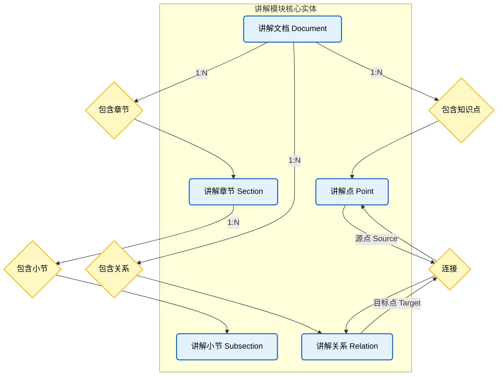

# 讲解模块数据结构图 (Explanation Module Structure)

## 实体说明

1.  **讲解文档 (ExplanationDocument)**：
    *   `explanation_documents`
    *   讲解内容的顶层容器，对应一次完整的学习产出。
    *   包含文档的元数据（标题、描述、状态）和图谱配置。

2.  **讲解章节 (ExplanationSection)**：
    *   `explanation_sections`
    *   文档的一级目录结构。
    *   包含章节标题、摘要和内容。

3.  **讲解小节 (ExplanationSubsection)**：
    *   `explanation_subsections`
    *   章节下的子结构，是内容的具体承载单元。

4.  **讲解点 (ExplanationPoint)**：
    *   `explanation_points`
    *   从文档内容中提取的核心概念或知识点。
    *   包含定义、解释、公式/代码示例等详细信息。
    *   直接归属于文档，不局限于特定章节，可跨章节引用。

5.  **讲解关系 (ExplanationRelation)**：
    *   `explanation_relations`
    *   定义两个讲解点之间的逻辑关系（如“包含”、“导致”、“相关”）。
    *   用于在文档内部构建小型的知识图谱网络。
