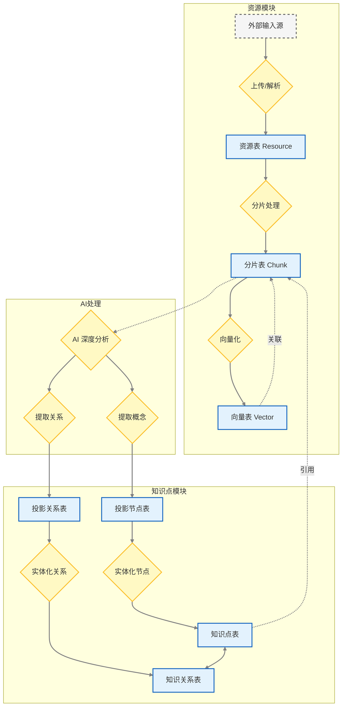

# 资源与知识图谱 AI 联动关系图 (Entity-Action View)

## 图例说明

*   **矩形 [ ]**：代表数据库中的**表实体 (Entity)**，用于存储数据。
*   **菱形 { }**：代表系统或 AI 执行的**动作 (Action)**，用于处理数据。
*   **虚线矩形 [ ]**：代表外部输入或非系统内的实体。

## 流程详解

1.  **资源处理流**：
    *   外部输入经过 **{上传/解析}** 动作，存入 **[资源表]**。
    *   资源经过 **{分片处理}** 动作，生成 **[分片表]** 数据。
    *   分片经过 **{向量化}** 动作，生成 **[向量表]** 数据。

2.  **知识提取流**：
    *   AI 对分片进行 **{AI 深度分析}**。
    *   通过 **{提取概念}** 动作，生成 **[投影节点表]** 数据。
    *   通过 **{提取关系}** 动作，生成 **[投影关系表]** 数据。

3.  **知识构建流**：
    *   投影节点经过 **{实体化节点}** 动作（通常包含用户确认），转变为正式的 **[知识点表]** 数据。
    *   投影关系经过 **{实体化关系}** 动作，转变为正式的 **[知识关系表]** 数据。
